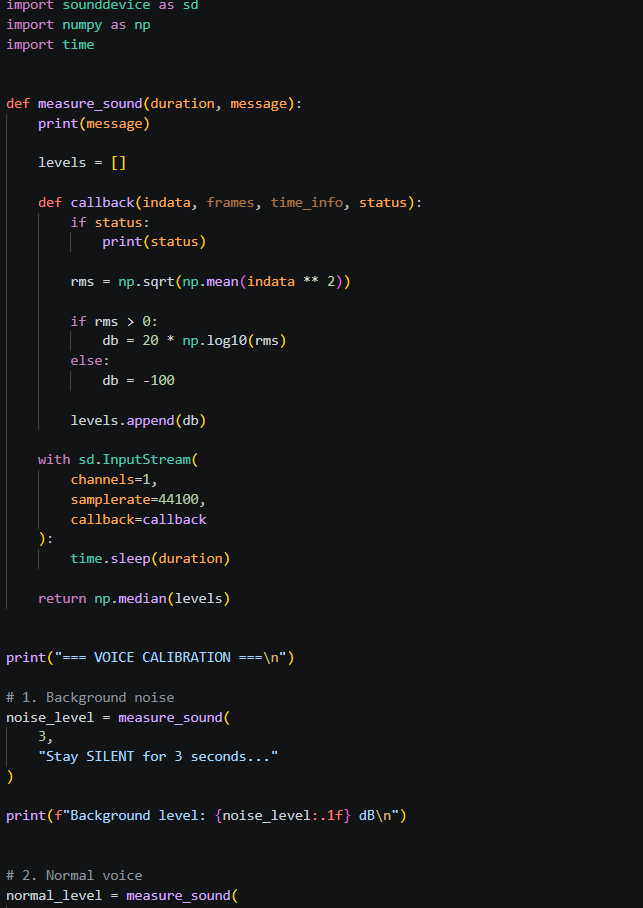
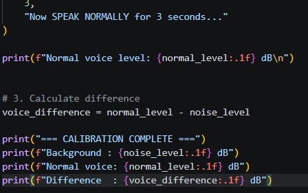
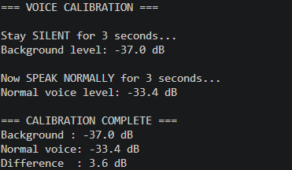
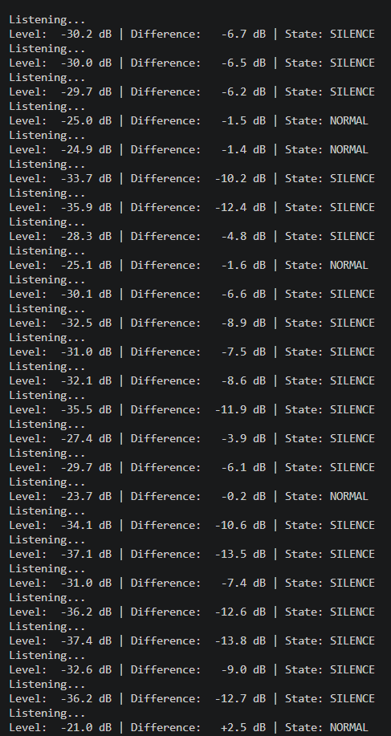

# VolumeShouter 🎯

## Basic Details
### Team Name: Error.exe

### Team Members
- Team Lead: Rahul - NSS College of Engineering, Palakkad
- Member 2: Navaneeth M - NSS College of Engineering, Palakkad

## Project Description

### 🔊 VolumeShouter: The Anti-Social Audio Controller

> *Because pressing standard volume buttons is far too mainstream and socially acceptable.*

### 🧐 What is this?
Built for the **Tinker Hub Useless Projects Makeathon**, **VolumeShouter** is a gloriously counter-intuitive Python script that takes complete control of your operating system's master volume based entirely on your vocal delivery. 

By weaponizing your microphone, this project forces you into moments of absolute social chaos. Trying to quietly watch a video in a crowded room? Too bad—whispering frantically will only blast your speakers to maximum volume.

---

### ⚡ The Chaos Logic (Reverse Calibration)
We inverted standard audio logic to maximize maximum uselessness:
*   🤫 **Whispering / Speaking Softly:** The system thinks you need more audio, so it aggressively triggers **Volume UP**.
*   🗣️ **Screaming / Yelling:** The system panics at the noise pollution and triggers **Volume DOWN**.

---

## The Problem (that doesn't exist)
The main problem we found was that people are using their hands for decreasing and increasing the system volume, which is very much exhausting process

## The Solution (that nobody asked for)
We found out that using our voice is much simpler and decided to make a voice controlled system volume controller

## Technical Details
### Technologies/Components Used:
*   **Python**: The backbone of the operation.
*   **`sounddevice module`**: Grabs real-time audio streams directly from your headphone microphone.
*   **`numpy module`**: Handles the underlying array math to process audio data.
*   **`pyautogui module`**: Simulates physical media keypresses to manipulate the OS volume.

### Implementation
For Software:
# Installation
- Installed python
- Installed libraries : python -m pip install sounddevice numpy pyautogui

# Run
- Run the command: python main.py

### Project Documentation
In this version the basic input feature of the project is first tested to see the normal value of sound. For this we first check the actual background noise and sound when speaking normally. Then the difference between these are found out and this difference is used to check if the level of sound is louder or quieter.

After this the, caliberation is implemented in the python code. For testing purposes, Before directly controlling the windows volume we are giving output feedback as messages-"LOUD","SILENT" and "NORMAL"

# Screenshots 

Code for finding the difference in background noise and actual voice 

Output of code for finding the difference in background noise and actual voice

Output showing feedback for different sound signal

--Made with ❤️ at TinkerHub Useless Projects--

